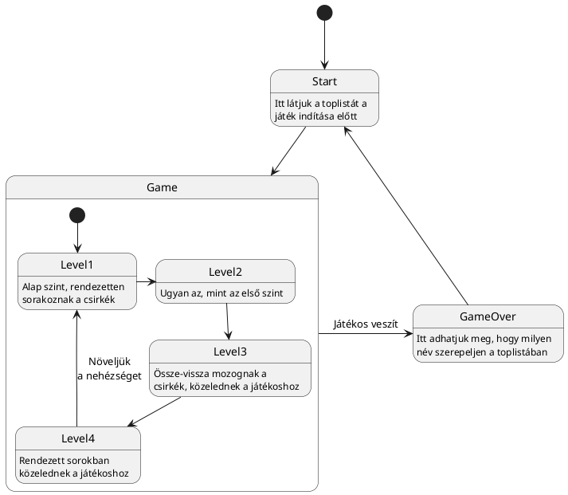

# ChickenSCH - Terv

## A program magas szintű működése

- Start
  - load leaderboard from disc
  - display leaderboard
  - display text indicating how to start the game
  - start game
- Game
  - level manager starts current level
  - level manager keeps track of level progress
  - once level is cleared load next level
  - if the player dies set scene to game over
- GameOver
  - Allow player to input their name
  - once enter is pressed the name is saved to the leaderboard
  - go back to the starting scene

